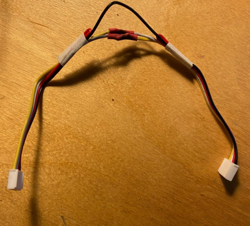

# meshbot v 0.1
Control **almost anything** with Meshtastic

The basic idea of this project is to create a small bot capable of **field operations**, or even a very simple **BBS** (Bulletin board system) based on microntrollers.

## What we need:
* a meshtastic radio (I am using a [XIAO ESP32S3 & Wio-SX1262 Kit for Meshtastic & LoRa](https://www.seeedstudio.com/Wio-SX1262-with-XIAO-ESP32S3-p-5982.html?)
* a second radio from which to send data (paired with a cell phone) I'll be using a [T1000E from Seeed](https://www.seeedstudio.com/SenseCAP-Card-Tracker-T1000-E-for-Meshtastic-p-5913.html?)
* a microcontroller (I used another Xiao ESP32S3 to receive protobuf data from the Meshtastic Radio and doing stuff)
* a voltage converter (optional)
* a switch (optional)
* two Xiao Grove Shields (for purely educational purposes - I'm getting old. You can skip them if you want to make you project tinyer and save money.
* a [Grove Micro Servo](https://wiki.seeedstudio.com/Grove-Servo/)
* a [Grove Chainable LED](https://wiki.seeedstudio.com/Grove-Chainable_RGB_LED/) 
* a [Grove DHT20](https://wiki.seeedstudio.com/Grove-Temperature-Humidity-Sensor-DH20/) Temperature and Humidity Sensor

### Software side, we use:
- [meshtastic web flasher](https://flasher.meshtastic.org/)
- [meshtastic console](https://client.meshtastic.org/)
- [Arduino IDE with ESP32 core](https://wiki.seeedstudio.com/xiao_esp32s3_getting_started/#software-preparation)
- [Meshtastic's Protobuf library for Arduino](https://github.com/meshtastic/Meshtastic-arduino)

## 1) Flashing Radio n° 1

Visit [meshtastic web flasher](https://flasher.meshtastic.org/) and follow the instructions. 

## 2) Configuring the Radio

While you can go on from here using the Android or iOS app, I'll stick with the [meshtastic console](https://client.meshtastic.org/). 
We are going to **define its Serial pins** (based on Xiao's pin mapping) and **enable protobuf communication**: **RX 44, TX 43**

Since I'm using the [Xiao Grove Shields](https://wiki.seeedstudio.com/Grove-Shield-for-Seeeduino-XIAO-embedded-battery-management-chip/) I'm also sharing this useful image of the pin mapping. 

## 3) Listening to the Serial Port using Protobuf from another Xiao

Let's connect the two boards in this way. 
Important TX is going to RX, and viceversa. Do not connect 3V3 for now. 

In order to have a cable for the serial communication I changed a grove connector making it usable changing TX to RX and vice versa. 

After installed the library, we can run [this code](./proto-all/proto-all.ino) in order to read whichever is passing via the serial and read all the nodes received in the serial port. 

Don't worry: we are going to fine tune this code in order to do less.

This is the Arduino code --> [proto-all.ino](./proto-all/proto-all.ino)

## 4) Meshbot Basic Tasks: The bot structure.

Let's say we want the bot to react to 4 commands: /help, /servo, /red, /temp
* "/help" is gonna respond with all the messages
* "/servo" will trigger some [Micro Servo](https://wiki.seeedstudio.com/Grove-Servo/) movement
* "/red" will trigger a [Chainable LED](https://wiki.seeedstudio.com/Grove-Chainable_RGB_LED/)
* "/temp" will answer with the temperature and humidity perceived from [Grove DHT20](https://wiki.seeedstudio.com/Grove-Temperature-Humidity-Sensor-DH20/)

In this scenario, you should be able to trigger these states via whichever command received. Obviously we could secure our system by specify which channel or sender to obey.

If you want to run this test (and poccibly hook up different sensors and actuators than the one I chose) the backbone is [echobot.ino](./echobot/echobot.ino)

Now we are going to add and test each individual sensor and actuator. 

* the [Micro Servo](https://wiki.seeedstudio.com/Grove-Servo/) using [servo-test.ino](./servo-test/servo-test.ino) and [ESP32Servo Library](https://github.com/madhephaestus/ESP32Servo)
* the [Chainable LED](https://wiki.seeedstudio.com/Grove-Chainable_RGB_LED/) using [this example](./ChainLED-example/ChainLED-example/ainLED-example.ino) and [its library](https://github.com/pjpmarques/ChainableLED/)
* the [Grove DHT20](https://wiki.seeedstudio.com/Grove-Temperature-Humidity-Sensor-DH20/) using the [traditional Library from Seeed](https://github.com/Seeed-Studio/Grove_Temperature_And_Humidity_Sensor) and [this code](./DHTtester/DHTtester.ino)

Lets test: both devices are in "longFast" and see each other. 

Have fun!

### Extra Chapter: Neopixels

Why haven't I used Neopixels? Well, I wanted in the first place, but I had problems in using them with the ESP32S3 (and the Xiao on which it's soldered). 

Thanks to my friend Peter I was able to understand this was caused by the library, so I ditched (this time) Neopixel Library to go (back) to [FastLED](https://fastled.io/). Now it works but I was already finishing the project. More examples and tests soon! 